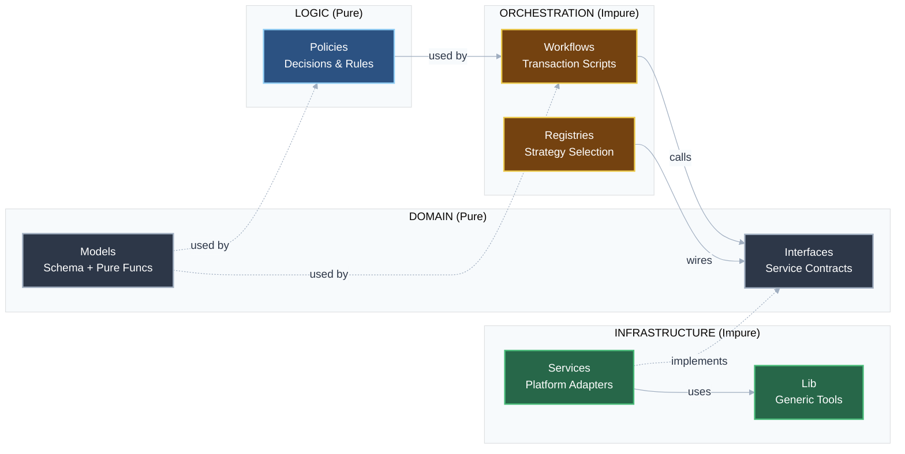

# effect-template
A template repository for LLM-driven development of Effect applications following **workflow-centric functional domain-driven design**, with comprehensive documentation, rules, and checklists designed for AI consumption.

## What Is This?

This is **not** a traditional application template. Instead, it's a meta-template designed to accelerate LLM-assisted development by providing:

1. **Centralized Rules & Patterns**: A single source of truth for architectural patterns, coding conventions, and best practices for Effect-based TypeScript applications
2. **LLM-Optimized Documentation**: Structured documentation that serves as context for AI assistants to scaffold new projects correctly
3. **Automated Code Review**: Checklists that enable LLMs to self-review their output before human review, catching common issues automatically
4. **Reusable Foundation**: Fork this repository to quickly start new projects with pre-configured architectural guidance

## How to Use

1. **Fork this repository** when starting a new Effect project
2. **Provide relevant documentation** from `docs/` as context to your LLM
3. **Ask the LLM to scaffold** your application following the documented patterns
4. **Use checklists** (in `docs/framework/effect/checklists/`) to have the LLM review its own code
5. **Review the LLM's work** knowing common issues have already been addressed

## The Design Process

When starting a new feature, create a markdown file in the `design/` directory (e.g. `design/my-feature.md`).
The LLM will automatically load the design process rules. You can instruct the LLM to:
"Help me design [Feature Name] following the TDFDDD process in `docs/core-rules/topics/design-process.md`."

## Design Overview

This template promotes **workflow-centric functional domain-driven design** - an architectural approach where workflows orchestrate pure business logic through composable layers, combining the pipeline patterns from functional programming with domain-driven design principles.

The architecture follows an "onion" pattern: **pure functions at the center, data validation and I/O at the edges**. Your core business logic remains pure and testable, while side effects are pushed to the outer layers where they can be managed through Effect's service system.

### Books
This is a project template that is based on Scott Wlaschin's [*Domain Modeling Made Functional*](https://pragprog.com/titles/swdddf/domain-modeling-made-functional/). It also uses some of the ideas from Eric Normand's [*Grokking Simplicity*](https://www.manning.com/books/grokking-simplicity).

### General Ideas
The project is focused on allowing you to do domain driven design with a pre-planned layout for following the pipeline style that Wlaschin describes in his book. Both Wlaschin and Normand talk about separating your project into several parts. As Normand puts it there are "Data, Calculations, and Actions".

- Data: The actual data, like `5`, `value`, `<object>`
- Calculations: Pure functions that have no side effects
- Actions: Functions that change the world, they take "action", like writing to the database

Wlaschin describes similar things in his book. He talks about the idea of an "onion architecture" - you do data validation and I/O on the outermost layers, and get more functional as you go deeper into the program. At the center are pure pipelines containing your business logic.

### TypeScript's Effect
This project uses `Effect` for its improvement of the standard library, functional features, `ZIO` type system, and relies heavily on the `services`/`layers` components. Because the services and layers provide such an easy way to separate your application into composable pieces the project is laid out in the onion fashion Normand and Wlaschin talk about.

### Architecture Reasoning
#### Layers
This architecture is designed to take advantage of the layer system provided by effect and give some guidelines that allow room for abstraction as well as swapable layers for testing, and different backends.

The decision to go with "policies" and "checks" has unknown effects at this time. The reason for breaking that out was since there seemed to be two categories of decisions inside of workflows. There were the things that really had no reason to return anything other than a boolean. There were those that needed complex decisions and return values and those seemed like they should be separate in the code.

The platform layer and domain layer are designed such that it ensures easy abstractions to allow you to change the storage backend from neo4j to a filesystem with ease

#### Future
There might be a need to split the workflows into two layers: `workflows` and `orchestration` because the workflows might get hard to read if they are both doing the checks and gathering all the information for the policies

### Architecture Layers



**Layer Descriptions:**

- **Domain (Pure)**
  - **Models**: Data schemas and co-located pure logic (e.g., `Cart.isEmpty`).
  - **Interfaces**: Contracts for external capabilities (e.g., `PaymentRepo`).

- **Logic (Pure)**
  - **Policies**: Complex business rules and decision making (e.g., `determinePaymentStrategy`).

- **Orchestration (Impure)**
  - **Workflows**: The "script" of the application. Coordinates domain, policies, and services.
  - **Registries**: Handles dynamic runtime selection of service implementations (Strategy Pattern).

- **Infrastructure (Impure)**
  - **Services**: Concrete implementations of Domain Interfaces (e.g., `StripeService`).
  - **Lib**: Generic internal libraries and helpers (e.g., `Neo4jClient`).

For a detailed source code directory layout, see [docs/project-structure/directory-layout.md](docs/project-structure/directory-layout.md).

## Documentation Structure
There are several levels of rules:
1. Core Rules
2. One Line Examples
3. Detailed Examples

The documentation is organized as follows:

```
docs/
├── core-rules/
│   ├── core.md
│   ├── level-1/
│   └── level-2/
├── framework/
│   └── effect/
│       ├── <topic>/
│       │   ├── level-1/
│       │   └── level-2/
│       └── checklists/
│           └── <split into 20 item chunks>
├── project-structure/
│   ├── overview.md
│   ├── directory-layout.md
│   └── conventions.md
└── template-details/
    ├── rule-examples.md
    └── considerations.md
```

For detailed examples of each rule level, see [docs/template-details/rule-examples.md](docs/template-details/rule-examples.md).
